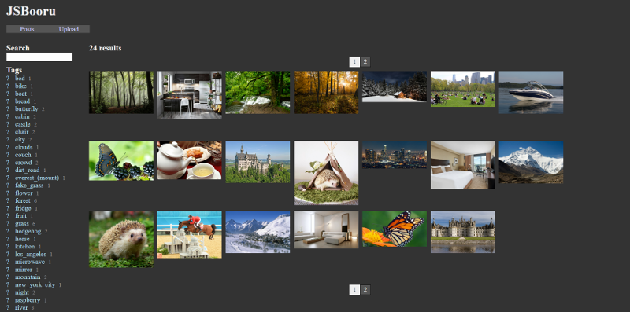

# JSBooru

## Description

JSBooru is a project to recreate a NodeJS version of the popular Booru websites starting from Danbooru onwards.

It's not intended for scalability, and will be optimized for small Unix environments. These requirements will probably change.

This project was originally made for a raspberry based Booru board.

### Features

Here is a list of feature we would want to integrate to JSBooru - starting from the most obvious ones to the most advanced !

- [ ] Upload pictures, picture info (such as source)
- [ ] Add tags to pictures
- [ ] Search by tags
- [ ] Tag categories
- [ ] Score/favourites sytem and related searches
- [ ] User login and options (exclude tags, disable comments, ...)
- [ ] Comment system
- [ ] Notes/translations system
- [ ] Wiki & Tag definitions
- [ ] Administration (flags, appeals, user management, image management)
- [ ] Board API
- [ ] Neverending scrolling
- [ ] Customizable board theme
- [ ] User themes

Here are some other features that we don't want to implement

- Forums : there is a lot of forum projects, just use one of them and redirect to them.

Feel free to propose other features as issues ! We will add them to the feature list or to the rejected list as they go, so don't hesitate to check back here from time to time.

## Getting started - installing

No releases are currently available. Check back later !

## Configuration

For now, the project isn't even out of alpha so there's no configuration options available.

The end goal is to have server-wide conigurations such as :

- [ ] The need for user login to do some actions (post pictures, add tags, add notes, write comments).
- [ ] Where the files are stored.
- [ ] Whether to self-host or remote-host the files with things like imgur.
- [ ] Default user/admin options, so you don't have to login on your own server.
- [ ] API management (on/off, manage tokens, limit features, throttle...)

In addition, user configs such as :

- [ ] Neverending board scroll
- [ ] Exclude tags
- [ ] Show/hide comments

As well as administrative features :

- [ ] Image management (delete pictures)
- [ ] User management (promotion, ban)
- [ ] Promotion levels

### Adding themes

Themes are not implemented yet. Check back later !

## Getting started - developping

### General informations

The project will be built using es7. All transpiling is done automatically, so don't worry about it too much.

### Librairies used

The goal is to use 100% Javascript/NodeJS librairies.

- [TingoDB](http://www.tingodb.com/)
  - Cool tiny project, uses the same api as MongoDB so upgrading to it should be a piece of cake !
  - The idea is to have all the TinyDB initialization part in a file, and to switch the file with their MongoDB equivalents when needed.
  - Note : as the database would quickly become the bottleneck of such a project, switching to MongoDB is something that would be advisable after a given user count.
  - As such, there might be an already created MongoDB implementation hidden behind a server config down the line.
- [Express](http://expressjs.com/)
  - ExpressJS is THE reference for NodeJS servers.
- [ECT](http://ectjs.com/)
  - ECT is a very cool template engine that, like most Javascript template engines, allows to process them client-side or server-side.
  - In addition, ECT has a server-side compilation phase and a client-side execution phase.
  - ECT is advertised as having very good performances. We never tried it before, so it is an occasion to test it.

This list is very likely to expand or evolve as the project grows.

## License

This project is MIT. You can do with it as you like.

Note that any board made with the JSBooru project isn't necessarily endorsed by the JSBooru team.  
Because the project is MIT, we can't even disallow them to use our codebase, so don't bother to ask.